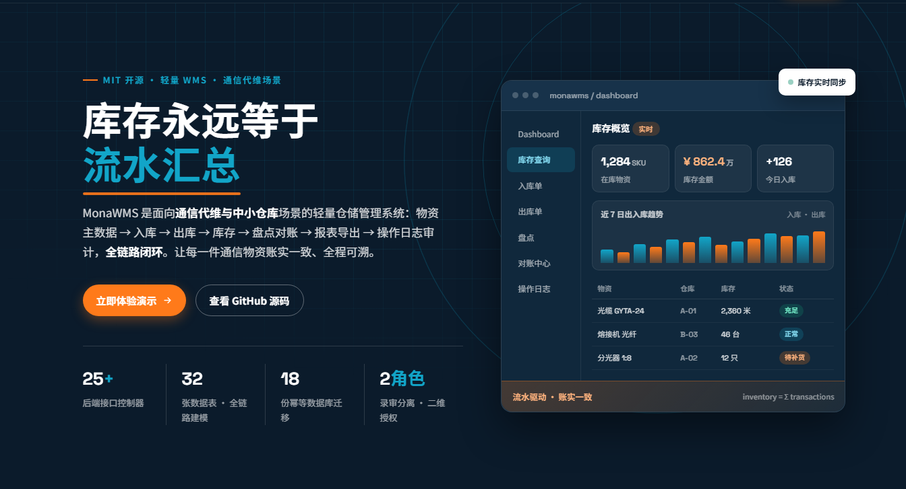
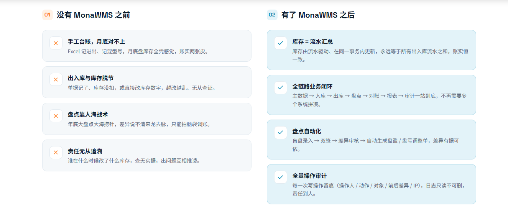
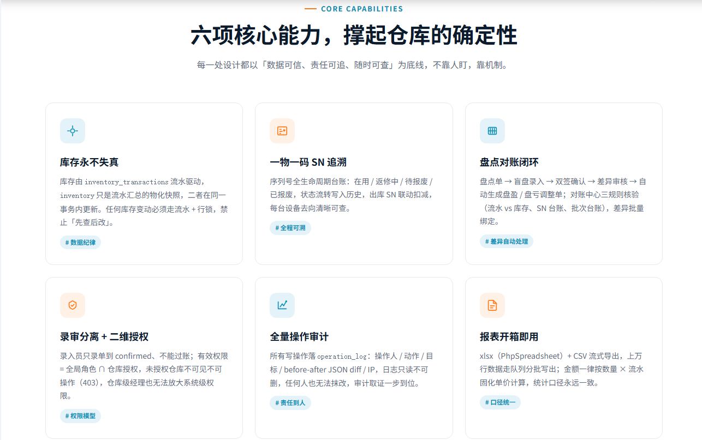

# MonaWMS — 通信代维物资仓储管理系统



> 面向通信代维/小仓库场景的轻量 WMS：物资主数据 → 入库 → 出库 → 库存 → 盘点对账 → 报表导出 → 操作日志审计，全链路闭环。
> **库存永远等于流水汇总**：库存由 `inventory_transactions` 流水驱动，`inventory` 只是流水汇总的物化快照，二者在同一事务内更新。

## 在线演示

| 项目 | 内容 |
|---|---|
| 演示地址 | http://8.152.97.191:9110/login |
| 管理员账号 | `admin` / `password` |
| 录入员账号 | `operator` / `password` |

> 演示环境为共享实例，请勿录入真实业务数据；管理员可登录后在「用户管理」修改密码。

## 为什么需要 MonaWMS



---

## 一、功能概览



| 模块 | 说明 | 前端页面 |
|---|---|---|
| 登录 / 个人中心 | JWT 认证、access token 2h、刷新续签 | `LoginPage` / `ProfilePage` |
|  Dashboard 看板 | 库存金额、出入库趋势、告警概览（recharts） | `DashboardPage` |
| **物资主数据** | SKU、名称、分类、型号、品牌、计量方式（计件/长度/重量/面积/体积）+ 计量单位字典、成本价、Excel 批量导入与模板下载 | `ProductsPage` |
| 分类管理 | 一/二级分类，树形展示，批量导入 | `CategoriesPage` |
| 仓库 / 库区 / 货架 / 库位 | 四级库内结构 CRUD | `WarehousesPage` |
| **入库管理** | 入库单（采购/调拨/归还/项目退回/借用归还/盘盈/其他）、来源与供应商、入库时间（含时分秒）、明细单位快照、批量序列号录入、**归档（软删）** | `InboundPage` |
| **出库管理** | 出库单、领用单位/领用人/手机号、出库时间、行锁扣减、SN 联动、归档 | `OutboundPage` |
| **库存查询** | 按仓库/SKU/批次/库位多字段筛选、即时回显、库存金额 | `InventoryPage` |
| **序列号（SN）** | 一物一码台账、状态流转（在用/返修中/待报废/已报废）、历史留痕 | `SerialNumbersPage` |
| **盘点** | 盘点单 → 盲盘录入 → 双签 → 差异审核 → 自动生成盘盈/盘亏调整单 | `StocktakePage` / `StocktakeExecutePage` / `StocktakeCountPage` |
| **对账中心** | 三规则对账（流水 vs 库存、SN 台账、批次台账）+ 批量绑定 + CSV 导出 | `ReconcilePage` |
| 库存流水 | 全部出入库/调整/盘点流水，可追溯 | `InventoryPage` / `ReportsController` |
| 报表导出 | xlsx（PhpSpreadsheet）+ CSV 流式，>1 万行走队列分批写出，写入操作日志 | `ReportsController` |
| 供应商 / 客户 | 主数据 CRUD | — |
| BOM | BOM 头/明细、复制、展开（ telecom 场景） | `BOMPage` |
| 项目 / 预留 | 项目台账、物资预留 | `ProjectsPage` |
| 报废申请 | 报废流程与「待报废」状态联动 | `ScrapPage` |
| 无线备件 | 无线侧备件专项台账 | `WirelessSparePartsPage` |
| 设备管理 | 设备台账（已收敛为 products + serial_numbers，`devices` 停用） | `DevicesPage` |
| 数据字典 | 12 类字典（计量单位、设备类型/型号/品牌、状态、入库来源…）后台可维护 | `DictionaryPage` |
| **授权矩阵** | 账号 × 仓库 二维授权，撤销留痕 | `GrantMatrixPage` |
| 用户管理 | 用户 CRUD、角色分配（admin / operator） | `UsersPage` |
| **操作日志** | 全量写操作审计（operator / action / target / before-after diff / IP），只读不可删 | `OperationLogPage` |
| **低代码表单 DIY** | 元数据驱动的自定义表单：设计草稿 → 发布（版本链 draft→published→archived，prop 冻结）→ 填写（服务端按元数据二次校验）→ 动态筛选（白名单防注入）→ CSV 导出；支持自然语言生成 schema 草稿 | —（后端 REST，前端页待接入） |
| **Agent 工具外露** | `/api/agent/tools` 工具清单（schema 读取/记录代填/查询/草稿/发布，含风险分级），供 Agent 客户端以同一套 REST 接口调用 | — |

---

## 二、技术栈

**后端**：ThinkPHP 6.1（PHP ≥ 7.2.5，实测 8.1 可用）· think-orm 2.x · firebase/php-jwt · phpoffice/phpspreadsheet
**数据库**：MySQL 5.7（InnoDB / utf8mb4，严格遵守 5.7 约束：无 CHECK、无 CTE/窗口函数、ONLY_FULL_GROUP_BY、无函数索引）
**前端**：React 18 + TypeScript + Vite 4 + Ant Design 5 + @tanstack/react-query 5 + Zustand + react-router-dom 7 + react-hook-form + zod + recharts
**移动端**：uni-app（H5 发行产物，预留 9111）
**部署**：Docker Compose（nginx 1.27 + php-fpm 8.1 + mysql 5.7），源码 volume 挂载，`git pull` 即时生效

---

## 三、目录结构

```
MonaWMS_TX/
├── backend_tp6/                 # ThinkPHP 6 后端
│   ├── app/
│   │   ├── controller/          # 28 个控制器：只收参数、只返响应
│   │   ├── service/             # 业务规则与事务（Auth/Inbound/Outbound/Inventory/Stocktake/Grant/FormMeta/FormRecord/…）
│   │   ├── model/               # 32 个模型：只做数据访问与关联
│   │   ├── middleware/          # Auth / Permission / WarehouseScope / OperationLog / Cors / ApiLog
│   │   ├── validate/            # 参数校验（不在 Controller 写 if）
│   │   └── common/library/Jwt.php
│   ├── database/
│   │   ├── migrations/          # 18 份幂等迁移（勿改历史文件，新增迁移）
│   │   └── seed/                # 15 份种子数据（主数据/仓库/用户授权/出入库/库存/SN/字典/表单DIY…）
│   ├── route/app.php            # 全部 /api 路由
│   └── config/                  # database / jwt / cache …
├── frontend/                    # React 18 管理端
│   └── src/{pages,services,components,store,hooks,utils,types,theme}
├── uniapp_frontend/             # uni-app 移动端（H5 产物不入库）
├── deploy/                      # nginx/default.conf、php/Dockerfile、setup_ecs.sh
├── sql/                         # 完整数据库快照
│   └── monawms_full_0930.sql    # ★ 建库 + 全部表结构 + 演示数据
├── docker-compose.yml           # 一键编排（前端 9110）
├── start_all.bat                # Windows 本地一键启动
└── 阿里云ECS部署方案.md
```

---

## 四、数据库

**完整快照**：`sql/monawms_full_0930.sql`（含 `CREATE DATABASE monawms`、34 张表结构与演示数据）

```bash
# 全新环境导入（会覆盖同名库，请先备份）
mysql -uroot -p < sql/monawms_full_0930.sql

# 或容器内导入
docker exec -i monawms_mysql mysql -uroot -p<密码> < sql/monawms_full_0930.sql
```

**增量迁移**（线上已建库时走这条，脚本可重复执行）：

```bash
# 依次执行 backend_tp6/database/migrations/*.sql
# 演示数据：backend_tp6/database/seed/*.sql（按 01→15 顺序）
```

主要表：

| 分类 | 表 |
|---|---|
| 主数据 | `products` `categories` `suppliers` `customers` `bom_headers` `bom_items` `bom_masters` |
| 库内结构 | `warehouses` `zones` `shelves` `locations` |
| 库存 | `inventory` `inventory_batches` `inventory_transactions` |
| 单据 | `inbound_orders/items` `outbound_orders/items` `stocktake_orders/items` |
| 追溯 | `serial_numbers` `serial_number_history` `operation_log` |
| 业务扩展 | `projects` `project_inventory_reservations` `scrap_applications` `wireless_spare_parts` `devices` |
| 表单 DIY | `form_metadata`（版本化元数据） `form_records`（记录，数据全进 `ext_attrs` JSON） |
| 组织与授权 | `users` `user_warehouse_grant` `dictionary_types` `dictionary_items` |

---

## 五、快速开始（本地开发）

### 1. 环境要求

- PHP ≥ 7.2.5（含 `bcmath`、`pdo_mysql`、`mbstring`、`openssl` 扩展）
- Composer 2
- MySQL 5.7（phpStudy 或小皮面板均可）
- Node.js ≥ 18、npm ≥ 9

### 2. 数据库

```bash
mysql -uroot -p < sql/monawms_full_0930.sql
```

### 3. 后端

```bash
cd backend_tp6
composer install
# 按需修改 .env（DATABASE / JWT 段）
php think run --host 0.0.0.0 --port 8000
# API 基址：http://127.0.0.1:8000/api
```

`.env` 关键配置：

```ini
[DATABASE]
HOSTNAME = 127.0.0.1
DATABASE = monawms
USERNAME = root
PASSWORD = root
HOSTPORT = 3306

[JWT]
KEY = monawms_jwt_secret_key_2024
EXP  = 7200        # access token 有效期（秒）
```

### 4. 前端

```bash
cd frontend
npm install
npm run dev        # 读取 .env：VITE_API_BASE_URL=http://127.0.0.1:8000/api
npm run build      # 读取 .env.production：VITE_API_BASE_URL=/api（同源，由 nginx 反代）
```

> 若后端端口不是 8000，修改 `frontend/.env` 的 `VITE_API_BASE_URL` 即可，**不要**在业务代码里手写域名。

### 5. Windows 一键启动

双击 `start_all.bat`：自动拉起 MySQL → 后端 8000 → 前端 Vite。

### 6. 默认账号

| 账号 | 密码 | 角色 |
|---|---|---|
| `admin` | `password` | 管理员（全部权限） |
| `operator` | `password` | 录入员（只能录单到 confirmed，不能过账） |

> 首次登录后请在「用户管理」修改密码。

---

## 六、部署（阿里云 ECS / Docker）

```bash
git clone <仓库> MonaWMS_TX && cd MonaWMS_TX
echo "MYSQL_ROOT_PASSWORD=你的强密码" > .env      # 与 docker-compose.yml 变量对应
docker compose up -d

# 前端构建产物（ECS 上由 node 构建，dist 不入库）
cd frontend && npm ci && npm run build

# 访问
http://<ECS公网IP>:9110/
```

- MySQL 容器**首次启动**自动导入 `sql/monawms_full_0930.sql`（建库 + 结构 + 演示数据）；数据卷非空时不会重复导入，需手动导入。
- 安全组只开放 **9110**（前端+API）、**9111**（uniapp H5，按需）；**禁止**开放 3306 / 9000 / 9080。
- `backend_tp6` 与 `frontend/dist` 均为 volume 挂载，改代码 / `git pull` 即时生效，无需重新 build 镜像。
- 详细步骤见 `阿里云ECS部署方案.md`。

---

## 七、API 概览

统一前缀 `/api`，统一响应体 `{ code, message, data, trace_id }`；业务错误走 **HTTP 200 + 业务码**，权限不足走 403。

| 分组 | 路径 | 说明 |
|---|---|---|
| 认证 | `/auth/login` `/auth/register` `/auth/refresh` `/auth/profile` `/auth/logout` | 登录/注册/续签/资料 |
| 字典 | `/dictionary/types` `/dictionary/items` | 字典类型与字典项 |
| 仓库 | `/warehouses` `/locations` | 仓库、库位 |
| 主数据 | `/products` `/categories` `/suppliers` `/customers` `/bom` | 物资、分类、往来单位、BOM |
| 库存 | `/inventory` `/inventory-transactions` | 库存查询、流水 |
| 单据 | `/inbound-orders` `/outbound-orders` `/stocktakes` | 入库 / 出库 / 盘点 |
| 追溯 | `/serial-numbers` `/barcode` `/logs` | 序列号、条码、操作日志 |
| 业务扩展 | `/projects` `/scrap` `/wireless-spare-parts` | 项目、报废、无线备件 |
| 报表 | `/reports` | 统计与导出（xlsx / CSV） |
| 组织 | `/users` `/grants` | 用户、仓库授权 |
| 表单 DIY | `/form-meta`（设计态：草稿/发布/diff/自然语言草稿） `/forms/:formKey/records`（运行态 CRUD/筛选/CSV 导出） | 元数据驱动自定义表单 |
| Agent | `/agent/tools` | 工具 manifest（6 个工具，含 endpoint/参数 schema/风险级） |

常见业务码：`STOCK_INSUFFICIENT`（库存不足，data 含缺料明细）、`DOC_STATUS_INVALID`、`MATERIAL_HAS_STOCK`、`PERMISSION_DENIED`(403)、`WAREHOUSE_NOT_GRANTED`(403)、`DUPLICATE_CODE`、`IDEMPOTENT_HIT`、`FORM_SCHEMA_INVALID`（元数据契约校验失败，data.errors 含明细）、`FORM_VALIDATION_FAILED`（记录校验失败，data.errors 含 [{prop,msg}]）、`FORM_FILTER_INVALID`（筛选/排序键在白名单外，防注入）、`RECORD_NOT_FOUND`(404)、`SYSTEM_ERROR`(500)。

---

## 八、权限与授权模型

全局只有两个角色：`admin`（管理员）、`operator`（录入员），设计原则是**录审分离**。

| 能力 | admin | operator |
|---|---|---|
| 查看库存 / 报表 / 看板 / 操作日志 | ✅ | ✅ |
| 主数据 CRUD（商品/分类/仓库/库位/供应商/客户） | ✅ | ❌ |
| 创建/编辑 入库单、出库单、盘点单 | ✅ | ✅ |
| **过账**（库存真正变动）、盘点过账、调整/移库、红冲 | ✅ | ❌ |
| 导出报表 | ✅ | ✅ |
| 用户管理、角色分配 | ✅ | ❌ |
| 修改/删除 `operation_log` | ❌ 任何人都不行 | ❌ |

**二维授权**：有效权限 = 全局角色 ∩ 仓库授权（`user_warehouse_grant`）。未授权仓库一律不可见、不可操作（403 `WAREHOUSE_NOT_GRANTED`）；仓库级 `grant_role=manager` 可在本仓库内等同管理员，但**不能放大**系统级权限。前端仓库切换器只展示已授权仓库，切换后所有请求自动带 `warehouse_id`。

---

## 九、开发规范（摘要，详见 `AGENTS.md`）

1. **严格分层**：Controller 只收参数返响应；Service 承载业务规则与事务；Model 只做数据访问。前端禁止写业务判断。
2. **库存不可直接 UPDATE**：库存变更必须走流水 + `Db::transaction` + `->lock(true)` 行锁，禁止"先查后改"。
3. **全量操作日志**：所有写操作落 `operation_log`（含 before/after JSON diff），日志表只读。
4. **软删除**：业务数据一律软删（`deleted_at`），出入库单的"删除"即归档，可翻查。
5. **数值精度**：数量与金额 `DECIMAL(18,4)`，PHP 侧按 string + **bcmath** 运算，禁止 float 累加。
6. **单据状态机**：`draft → confirmed → receiving/quality_check → posted`；已 posted 只能红冲。
7. **统计口径**：金额 = 数量 × 流水固化单价；时间统一用业务发生时间（入库 `received_at` / 出库 `shipped_at` / 流水 `occurred_at`），不用 `created_at`。
8. **MySQL 5.7 约束**：时间条件一律半开区间（`>= start AND < end`），禁用 `DATE(col)=?`；大表 DDL 需评估锁表。
9. 新增接口同步更新本文档与 `docs/`；迁移脚本必须可重复执行。

---

## 十、其他文档

| 文件 | 内容 |
|---|---|
| `AGENTS.md` | 项目宪法（业务背景、架构铁律、业务规则、错误码） |
| `阿里云ECS部署方案.md` | Docker 部署、安全组、端口规划、日常运维 |
| `待办清单.md` | 客户需求分解与验收自检清单 |
| `前端使用手册.md` | 页面级操作说明 |
| `后端方案.md` / `前端方案.md` / `分析.md` | 设计与评审记录 |
| `handoff.md` / `项目完善总结.md` / `修复说明.md` | 阶段交接与修复记录 |
| `prototype/` | 早期 HTML 原型 |

---

## 十一、联系方式

| 渠道 | 账号 |
|---|---|
| 手机 / 微信 | 18688361467 |
| 邮箱 | 352576216@qq.com |
| 邮箱 | esan.wu@gmail.com |

---

## 十二、常见问题

**Q：所有接口 401？**
access token 有效期 2 小时，前端会自动用 refresh token 续签；若 refresh token 也过期会强制登出，重新登录即可。排查顺序：后端 `.env` 的 `JWT.KEY` 是否被改动 → 数据库是否重新导入（token 签发密钥变化会让旧 token 失效）→ 浏览器清缓存后重登。

**Q：导入 SQL 后登录失败？**
完整快照里的用户密码均为 `password`（bcrypt）。若仍失败，确认 `users.status='active'` 且 `deleted_at IS NULL`。

**Q：产品下拉框（AutoComplete）"暂无数据"？**
产品接口返回分页对象 `{list, total, page, limit}`，调用方需读 `.list` 并传 `limit`，直接把对象当数组会恒空。

**Q：库存列表出现重复 key 警告？**
`rowKey` 必须用后端返回的 snake_case 字段（`product_id` / `warehouse_id` / `location_id` / `batch_no`），camelCase 字段为 undefined 会导致重复 key。
